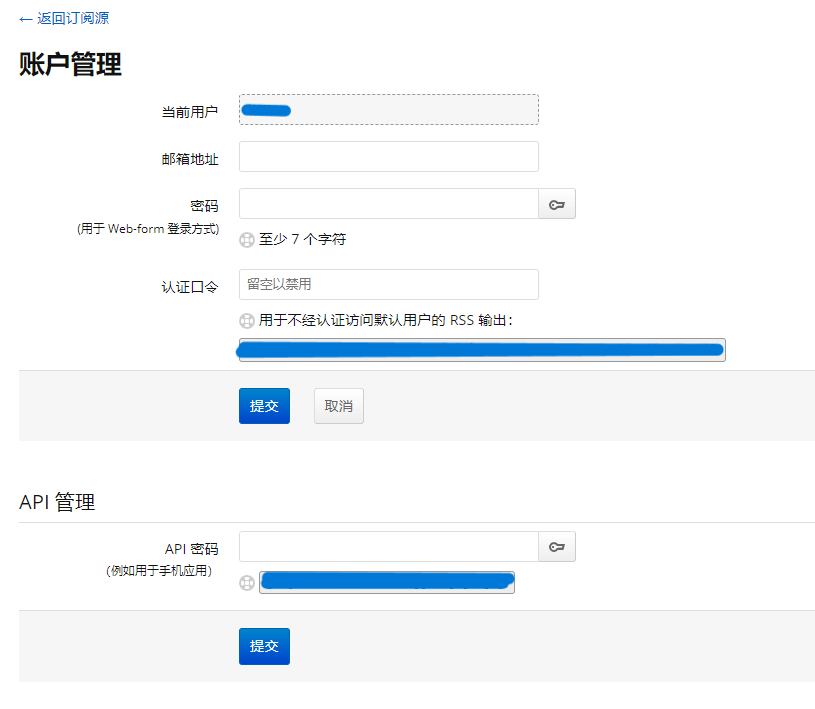
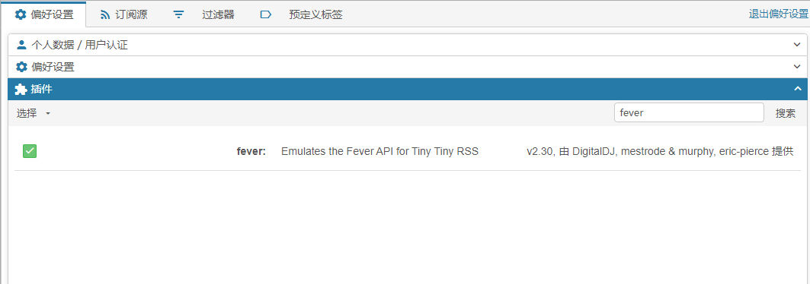
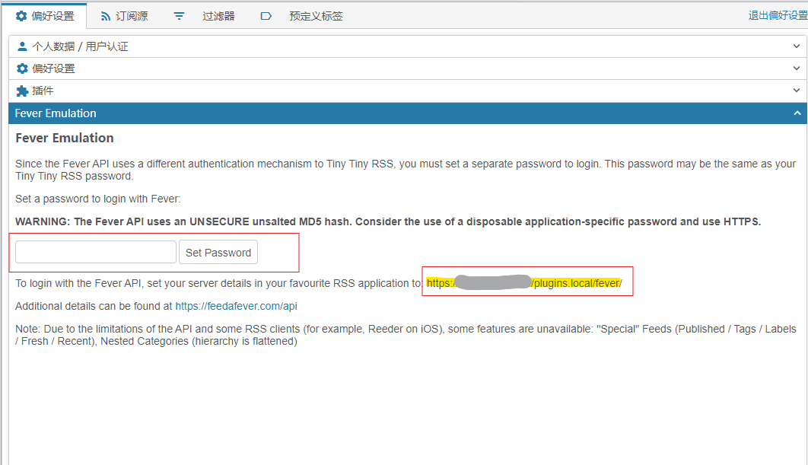

# RSS Service Integration Guide

## [The Old Reader](https://theoldreader.com/)
Integrating The Old Reader is straightforward.
::: tip
- Host：https://theoldreader.com/
- Username：Your email address
- Password：Your account login password
:::

## [Fresh RSS](https://freshrss.org/)
> FreshRSS uses the Google Reader API for integration by default.

Go to Settings -> Account Management.

Enter the API password and click "Submit Update." Then, click the link below to navigate to the FreshRSS API endpoints page.

::: tip
- Host：The URL ending with greader.php found on the FreshRSS API endpoints page under "Google Reader compatible API."
- Username: Your account username
- Password: API Password.(**Note: This is not your account password**）
:::

## [Miniflux](https://miniflux.app/)
> Miniflux uses the Google Reader API for integration by default.

Go to Settings -> Integrations, then expand the Google Reader section.

Check "Enable Google Reader API" and set the Google Reader username and password.
::: tip
- Host：Google Reader API endpoint URL
- Username：Google Reader username
- Password：Google Reader password
:::
## [Tiny Tiny RSS](https://tt-rss.org/)
> Tiny Tiny RSS currently only supports the Fever API and requires enabling the corresponding plugin. The setup can be cumbersome, and Fever API functionality is limited, so it is not highly recommended.

1. Open the plugin list, search for "Fever," and enable the Fever plugin.

2. In Preferences, enable the API by checking "Allow external clients to access this account through the API."

3. After installing the Fever plugin, go to Preferences -> Fever Emulation Settings, set up the Fever API password, and use the highlighted link as the domain (**remove ".local" from the URL**), e.g: https://ttrss.xxx/plugins/fever/.

::: tip
- Host：Provided in Fever Emulation Settings, e.g: https://ttrss.xxx/plugins/fever/ (**remove ".local" from the URL**)
- Username：The username used to log in
- Password：The Fever API password set in Fever Emulation Settings
:::
